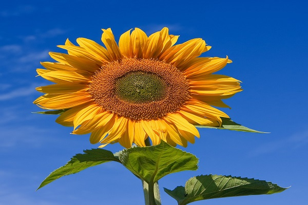

# Images and the Mouse

Yesterday, I had you guys struggle with coordinates for placing your initials and flower.
Today, we will go through some material and more that addresses this.
The key to this is to realize that the computer screen is nothing more than a fancy piece of graph paper.
Each pixel on the screen is a coordinate: two numbers - x (horizontal) and y (vertical).
These determine the location of a point in space.
Coordinates `(0, 0)` can be found at the top left of the window, with the positive direction to the right horizontally and down vertically.

## Shapes

In Processing, there are four primitive shapes: point, line, rectangle, and ellipse.

For each shape, we need to figure out what information is required to specify the location and size of that shape.
To get use to this, let's start with a window screen with a size of 10 x 10.

```python
def setup():
	size(10, 10)

def draw():
	point(4, 5) # placing a point shape at x = 4 and y = 5
```

As we can see, 10 x 10 creates a super small window, and the point is also very small.
Now, let's draw a line from `(1, 2)` to `(5, 2)`.

```python
def setup():
	size(10, 10)

def draw():
	line(1, 2, 5, 2)
```

Point and line shapes are pretty simple so far, but what if we want to create a rectangle?
Rectangles become a bit more complicated as a rectangle is created with the coordinates for the top left corner and then the width and height: `rect(x, y, width, height)`.

```python
def setup():
	size(10, 10)

def draw():
	rect(2, 2, 7, 5)
```

Above is one way to draw a rectangle.
Another way is to specify the center point along with the width and height.
To do this, we must first indicate the `rectMode` to be `CENTER`:

```python
def setup():
	size(10, 10)

def draw():
	rectMode(CENTER)
	rect(4, 4, 7, 3)
```

A third way to draw a rectangle is by using the rectMode `CORNERS` to give the top left corner and bottom left corner:

```python
def setup():
	size(10, 10)

def draw():
	rectMode(CORNERS)
	rect(2, 3, 7, 6)
```

The fourth primitive shape is ellipse.
We can draw ellipse on the board basically the same way as rectangles.

Regular:

```python
def setup():
  size(100, 100)

def draw():
  ellipse(45, 40, 80, 70)
```

Center:

```python
def setup():
	size(10, 10)

def draw():
	ellipseMode(CENTER)
	ellipse(4, 4, 5, 7)
```

Corner:

```python
def setup():
	size(10, 10)

def draw():
	ellipseMode(CORNER)
	ellipse(2, 2, 4, 7)
```

### Example

```python
def setup():
	size(200, 200)

def draw():
	rectMode(CENTER)
	rect(100, 100, 20, 100)

	ellipse(100, 70, 60, 60)
	ellipse(81, 70, 16, 32) 
	ellipse(119, 70, 16, 32) 

	line(90, 150, 80, 160)
	line(110, 150, 120, 160)
```

## Images

Yesterday, we did a brief introduction on images in Processing, but I didn't show a proper example.

<details>
<summary>Assets used in this example</summary>

Click on the links to download the files.

[mysummervacation.jpg](../assets/mysummervacation.jpg)


</details>

```python
def setup():
    global img
    size(1320, 2240)
    # Make a new instance of a PImage by loading an image file
    # Declaring a variable of type PImage
    img = loadImage("mysummervacation.jpg")

def draw():
    background(0)
    # Draw the image to the screen at coordinate (0, 0)
    image(img, 0, 0)
```

Processing accepts the GIF, JPG, TGA, and PNG image file types.

### Image Processing Filter

When displaying an image, you might like to alter its appearance.
You can achieve some simple image filtering using Processing's `tint()` function.
`tint()` is essentially the image equivalent of shapes' `fill()`.
It sets the colour and transparency for displaying an image on screen.
Obviously, images are not all one colour.
The `tint()` function arguments simply specify how much of a given colour to use for every pixel of that image and how transparent each pixel should be.

<details>
<summary>Assets used in this example</summary>

Click on the links to download the files.

[sunflower.jpg](../assets/sunflower.jpg)



</details>

```python
def setup():
  global sunflower
  size(1000, 1000)
  sunflower = loadImage("sunflower.jpg")

def draw():
  background(0)
  tint(255)
  image(sunflower, 0, 0)
```

At `255`, the image retains its original state.
If we reduce it to `100`, the image appears darker.

Now, if we add a second argument, it will change the image's transparency:

```python
def setup():
  global sunflower
  size(1000, 1000)
  sunflower = loadImage("sunflower.jpg")

def draw():
  background(0)
  tint(255, 130)
  image(sunflower, 0, 0)
```

If we were to have 3 arguments, it will affect the brightness of the RGB components of each colour.

```python
def setup():
  global sunflower
  size(1000, 1000)
  sunflower = loadImage("sunflower.jpg")

def draw():
  background(0)
  tint(0, 255, 130)
  image(sunflower, 0, 0)
```

If we have all 4 arguments, we can adjust the colours and the transparency.

```python
def setup():
  global sunflower
  size(1000, 1000)
  sunflower = loadImage("sunflower.jpg")

def draw():
  background(0)
  tint(255, 0, 140, 130)
  image(sunflower, 0, 0)
```

You can also use an image as the background of your sketch:

```python
def setup():
  global sunflower
  size(600, 400)
  sunflower = loadImage("sunflower.jpg")

def draw():
  img = loadImage("mysummervacation.jpg")
  background(img)
  tint(255, 100)
  image(sunflower, 0, 0)
```

## Mouse Data

Built-in Processing variables `mouseX` and `mouseY` store the x-coordinate and y-coordinate of the cursor relative to the origin in the upper-left corner of the display window.
To see the values being produced in console, run this program:

```python
def setup():
  size(600, 400)

def draw():
    frameRate(12)
    println(str(mouseX) + " : " + str(mouseY))
```

When a program starts, the `mouseX` and `mouseY` values are `0`.
When the cursor moves into the display window, the values are set to the current position of the cursor.
If the cursor enters at the left, `mouseX` value is `0` and the value increases as the cursor moves to the right.
If the cursor enters from the top, the `mouseY` value is `0` and increases as the cursor moves down.

The mouse position is most commonly used to control the location of visual elements on the screen.
You can create more interesting visual elements by using different mouse values, rather than just mimicking the current position.
Adding and subtracting values from the mouse position creates relationships that remain constant.
Multiplying and dividing these values create changing visual relationships between the mouse position and elements on the screen.

```python
def setup():
    size(100, 100)
    noStroke()

def draw():
    background(126)
    ellipse(mouseX, mouseY, 33, 33)
```

### Adding/Subtracting values

```python
def setup():
    size(100, 100)
    noStroke()

def draw():
    background(126)
    ellipse(mouseX, 16, 33, 33) # Top circle
    ellipse(mouseX+20, 50, 33, 33) # Middle circle
    ellipse(mouseX-20, 84, 33, 33) # Bottom circle
```

### Multiplying/Dividing values

```python
def setup():
    size(100, 100)
    noStroke()

def draw():
    background(126)
    ellipse(mouseX, 16, 33, 33)   # Top circle
    ellipse(mouseX/2, 50, 33, 33)   # Middle circle
    ellipse(mouseX*2, 84, 33, 33)   # Bottom circle
```

To invert the value of the mouse, subtract the `mouseX` value from the width of the window, and subtract `mouseY` from the height of the screen.
The built-in `height` and `width` variables can be used in place of hard-coded constants.

```python
def setup():
    size(100, 100)
    noStroke()

def draw():
    x = mouseX
    y = mouseY
    ix = width - mouseX # Inverse X
    iy = height - mouseY # Inverse Y
    background(126)
    fill(255, 150)
    ellipse(x, height/2, y, y)
    fill(0, 159)
    ellipse(ix, height/2, iy, iy)
```

The Processing variables `pmouseX` and `pmouseY` store the mouse values from the previous frame.
If the mouse does not move, the values will be the same, but if the mouse is moving quickly there can be large differences between the values.
Run the following code, move your mouse around in the window, and look at what is being printed in the console:

```python
def setup():
    size(100, 100)

def draw():
    frameRate(12)
    println(pmouseX - mouseX)
```

Let's draw a line from the previous mouse position to the current position to show the changing positions in one frame:

```python
def setup():
    size(100, 100)
    strokeWeight(8)


def draw():
    background(204)
    line(mouseX, mouseY, pmouseX, pmouseY)
```

## Mouse Buttons

Computer mice and other related input devices typically have between one and three buttons.
Processing can detect when these buttons are pressed with the `mousePressed` and `mouseButton` variables

```python
def setup():
    size(100, 100)

def draw():
    background(204)
    # the mousePressed variable is True if any mouse button is pressed
    # and False if no mouse button is pressed
    if mousePressed == True: 
        fill(255) # White
    else:
        fill(0) # Black
    rect(25, 25, 50, 50)


def setup():
    size(100, 100)

def draw():
    # The variable mouseButton is LEFT, CENTER, or RIGHT, depending on
    # the mouse button most recently pressed
    if mouseButton == LEFT:
        fill(0) # Black
    elif mouseButton == RIGHT:
        fill(255) # White
    else:
        fill(126) # Gray

    rect(25, 25, 50, 50)
```

The `mousePressed` variable reverts to `False` as soon as the button is released, but the `mouseButton` variable retains its value until a different button is pressed.
